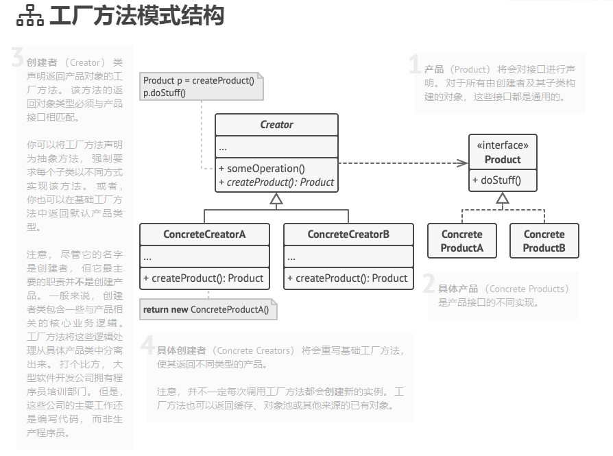

# 工厂方法模式

虚拟构造函数、Virtual Constructor、Factory Method

## 意图、目的

创建型设计模式，
在父类中提供一个创建对象的方法，允许子类决定实例化对象的类型。
解决了在不指定具体类的情况下创建产品对象的问题。

## 问题

扩展很麻烦，现有代码耦合

## 解决方案

特殊的工厂方法代替对于对象构造函数的直接调用，
对象仍通过 new 运算符创建，只是该运算符在工厂方法中调用。
工厂方法返回的对象通常被称为产品。
改变程序中调用构造函数的位置

仅当这些产品具有共同的基类或者接口时，子类才能返回不同类型的产品，同时基类中的工厂方法还应将其返回类型声明为这一共有接口。

## 模式结构

## 实现方式

1. 让所有产品都遵循同一接口。 该接口必须声明对所有产品都有意义的方法。

2. 在创建类中添加一个空的工厂方法。 该方法的返回类型必须遵循通用的产品接口。

3. 在创建者代码中找到对于产品构造函数的所有引用。 将它们依次替换为对于工厂方法的调用， 同时将创建产品的代码移入工厂方法。

   你可能需要在工厂方法中添加临时参数来控制返回的产品类型。

   工厂方法的代码看上去可能非常糟糕。 其中可能会有复杂的 switch 分支运算符， 用于选择各种需要实例化的产品类。 但是不要担心， 我们很快就会修复这个问题。

4. 现在， 为工厂方法中的每种产品编写一个创建者子类， 然后在子类中重写工厂方法， 并将基本方法中的相关创建代码移动到工厂方法中。

5. 如果应用中的产品类型太多， 那么为每个产品创建子类并无太大必要， 这时你也可以在子类中复用基类中的控制参数。

6. 如果代码经过上述移动后， 基础工厂方法中已经没有任何代码， 你可以将其转变为抽象类。 如果基础工厂方法中还有其他语句， 你可以将其设置为该方法的默认行为。

## 适用场景

- 当你在编写代码的过程中，如果无法预知对象确切类别及其依赖关系时，可使用工厂方法。
- 如果你希望用户能扩展你软件库或框架的内部组件，可使用工厂方法。
- 如果你希望复用现有对象来节省系统资源， 而不是每次都重新创建对象， 可使用工厂方法。

## 与其他模式的关系
