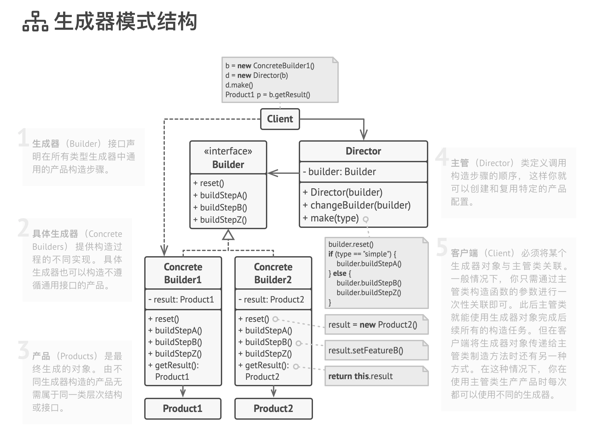

# 建造者模式

Builder 生成器模式

使你能够分步骤创建复杂对象。 该模式允许你使用相同的创建代码生成不同类型和形式的对象。

使用示例： 生成器模式是 TypeScript 世界中的一个著名模式。 当你需要创建一个可能有许多配置选项的对象时，该模式会特别有用。

识别方法： 生成器模式可以通过类来识别，它拥有一个构建方法和多个配置结果对象的方法。生成器方法通常支持方法链 （例如 someBuilder.​setValueA(1).​setValueB(2).​create()）。

## 模式结构

