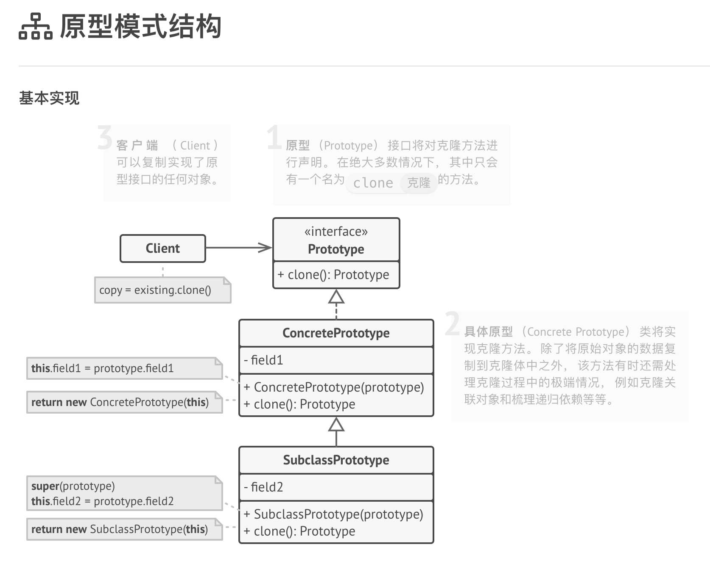
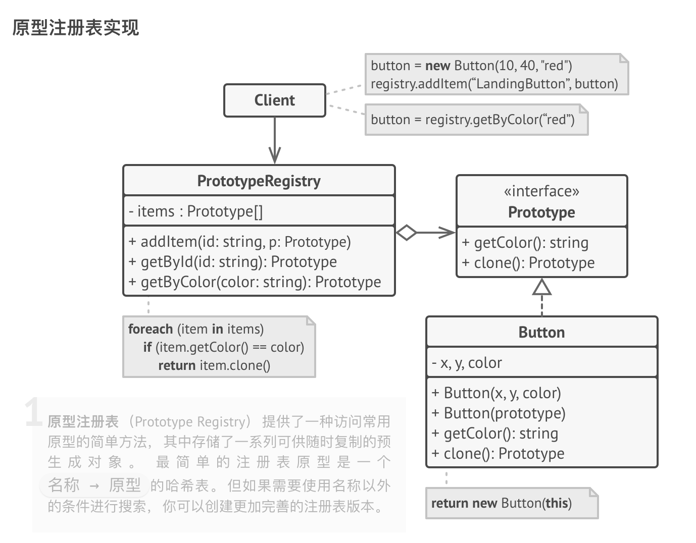

# 原型模式

原型是一种创建型设计模式， 使你能够复制对象， 甚至是复杂对象， 而又无需使代码依赖它们所属的类。

所有的原型类都必须有一个通用的接口， 使得即使在对象所属的具体类未知的情况下也能复制对象。 原型对象可以生成自身的完整副本， 因为相同类的对象可以相互访问对方的私有成员变量。

使用示例： TypeScript 的 Clone­able （克隆） 接口就是立即可用的原型模式。

识别方法： 原型可以简单地通过 clone 或 copy 等方法来识别。

## 模式结构

