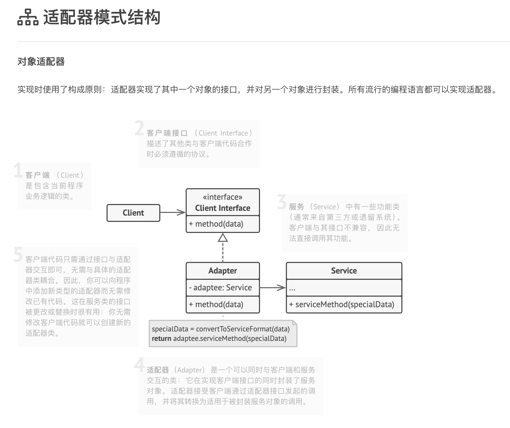
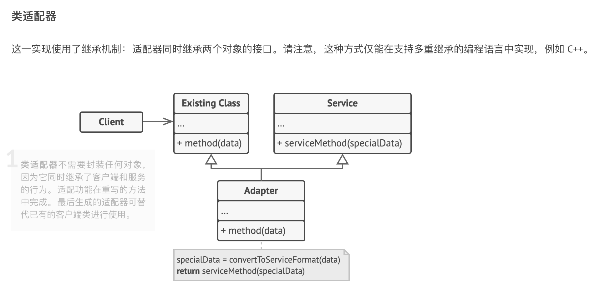

# 适配器模式

它能使不兼容的对象能够相互合作。

适配器可担任两个对象间的封装器， 它会接收对于一个对象的调用， 并将其转换为另一个对象可识别的格式和接口。

使用示例： 适配器模式在 TypeScript 代码中很常见。 基于一些遗留代码的系统常常会使用该模式。 在这种情况下， 适配器让遗留代码与现代的类得以相互合作。

识别方法： 适配器可以通过以不同抽象或接口类型实例为参数的构造函数来识别。 当适配器的任何方法被调用时， 它会将参数转换为合适的格式， 然后将调用定向到其封装对象中的一个或多个方法。

## 模式结构

