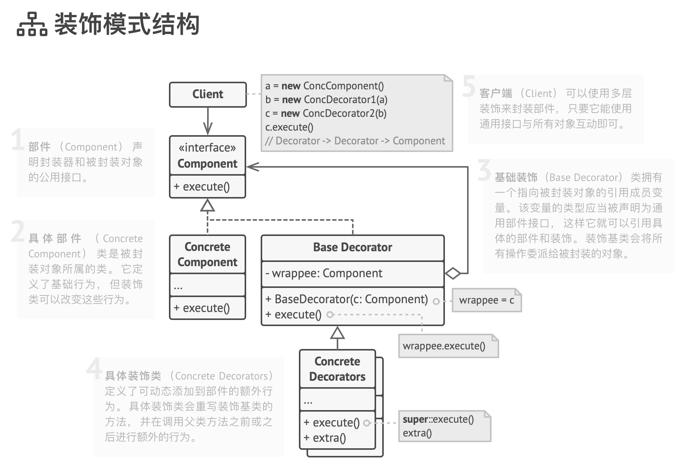

# 装饰模式

Wrapper、Decorator

允许你通过将对象放入特殊封装对象中来为原对象增加新的行为。

由于目标对象和装饰器遵循同一接口， 因此你可用装饰来对对象进行无限次的封装。 结果对象将获得所有封装器叠加而来的行为。

使用示例： 装饰在 TypeScript 代码中可谓是标准配置， 尤其是在与流式加载相关的代码中。

识别方法： 装饰可通过以当前类或对象为参数的创建方法或构造函数来识别。

## 模式结构

