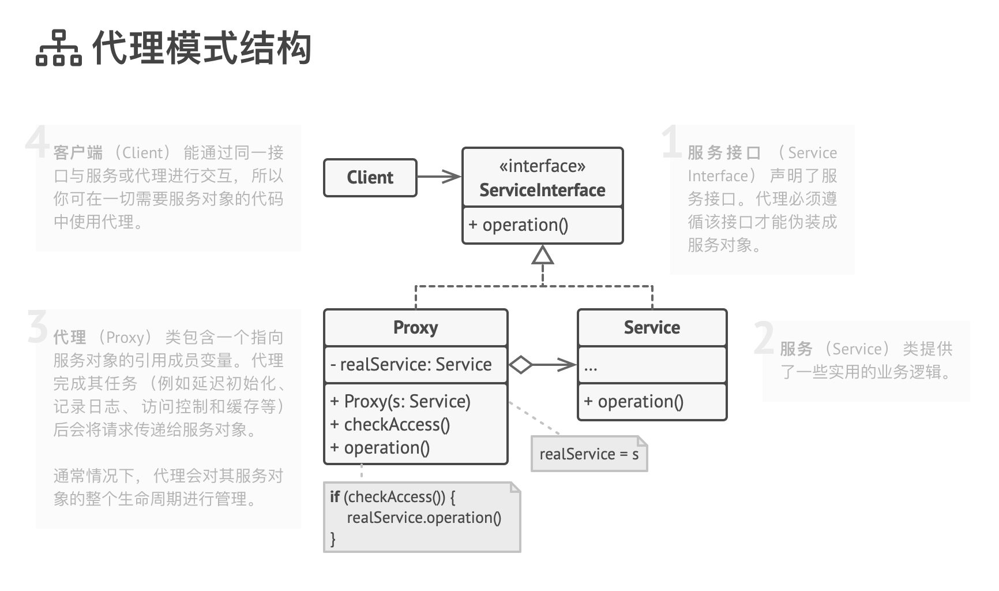

# 代理模式 Proxy

让你能够提供对象的替代品或其占位符。 代理控制着对于原对象的访问， 并允许在将请求提交给对象前后进行一些处理。

使用示例： 尽管代理模式在绝大多数 TypeScript 程序中并不常见， 但它在一些特殊情况下仍然非常方便。 当你希望在无需修改客户代码的前提下于已有类的对象上增加额外行为时， 该模式是无可替代的。

识别方法： 代理模式会将所有实际工作委派给一些其他对象。 除非代理是某个服务的子类， 否则每个代理方法最后都应该引用一个服务对象。

## 模式结构

