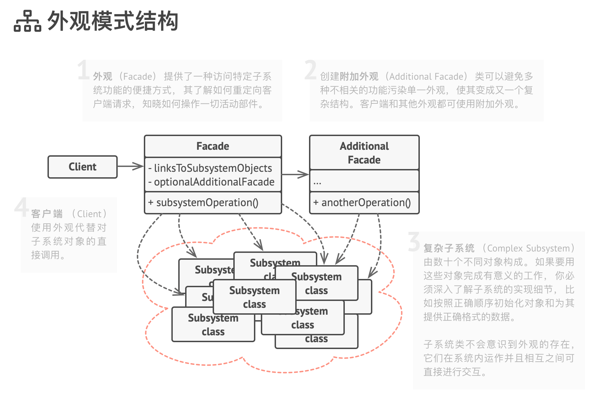

# 外观模式

Facade

外观是一种结构型设计模式， 能为复杂系统、 程序库或框架提供一个简单 （但有限） 的接口。

尽管外观模式降低了程序的整体复杂度， 但它同时也有助于将不需要的依赖移动到同一个位置。

使用示例： 使用 TypeScript 开发的程序中会经常使用外观模式。 它在与复杂程序库和 API 协作时特别有用。

识别方法： 外观可以通过使用简单接口， 但将绝大部分工作委派给其他类的类来识别。 通常情况下， 外观管理其所使用的对象的完整生命周期。

## 模式结构

