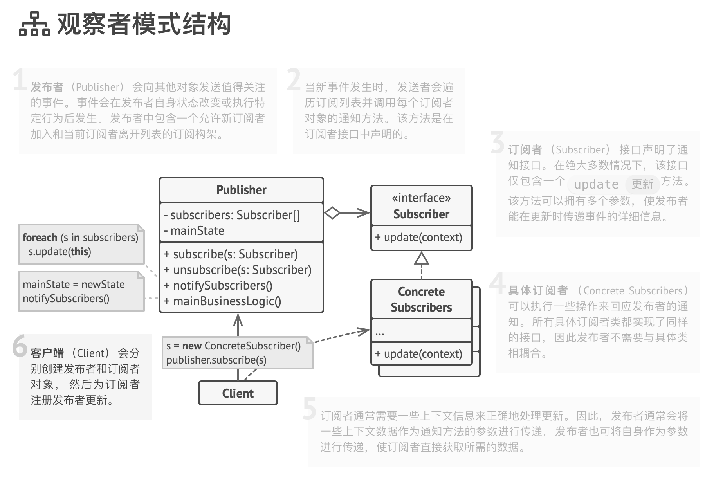

# 观察者模式

事件订阅者、监听者、Event-Subscriber、Listener、Observer

观察者模式是一种行为设计模式， 允许你定义一种订阅机制， 可在对象事件发生时通知多个 “观察” 该对象的其他对象。

拥有一些值得关注的状态的对象通常被称为目标， 由于它要将自身的状态改变通知给其他对象， 我们也将其称为发布者 （pub­lish­er）。 所有希望关注发布者状态变化的其他对象被称为订阅者 （sub­scribers）。

使用示例： 观察者模式在 TypeScript 代码中很常见， 特别是在 GUI 组件中。 它提供了在不与其他对象所属类耦合的情况下对其事件做出反应的方式。

识别方法： 该模式可以通过将对象存储在列表中的订阅方法， 和对于面向该列表中对象的更新方法的调用来识别。

## 模式结构

