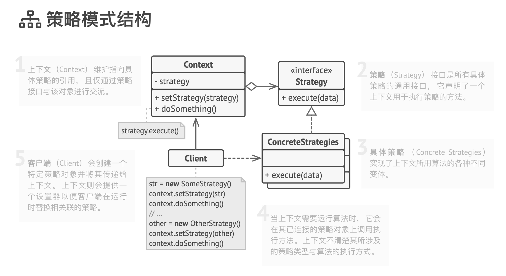

# 策略模式

strategy

策略是一种行为设计模式， 它将一组行为转换为对象， 并使其在原始上下文对象内部能够相互替换。

原始对象被称为上下文， 它包含指向策略对象的引用并将执行行为的任务分派给策略对象。 为了改变上下文完成其工作的方式， 其他对象可以使用另一个对象来替换当前链接的策略对象。

使用示例： 策略模式在 TypeScript 代码中很常见。 它经常在各种框架中使用， 能在不扩展类的情况下向用户提供改变其行为的方式。

识别方法： 策略模式可以通过允许嵌套对象完成实际工作的方法以及允许将该对象替换为不同对象的设置器来识别。

## 模式结构

