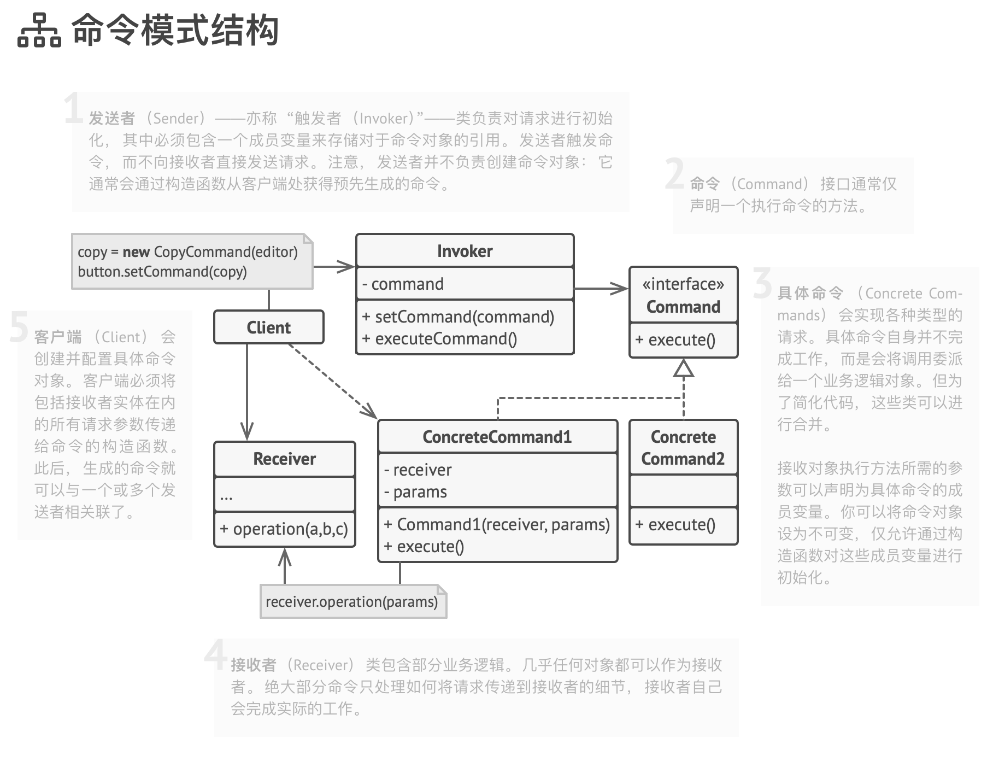

# 命令模式

命令是一种行为设计模式， 它可将请求或简单操作转换为一个对象。

此类转换让你能够延迟进行或远程执行请求， 还可将其放入队列中。

使用示例： 命令模式在 TypeScript 代码中很常见。 大部分情况下， 它被用于代替包含行为的参数化 UI 元素的回调函数， 此外还被用于对任务进行排序和记录操作历史记录等。

识别方法： 命令模式可以通过抽象或接口类型 （发送者） 中的行为方法来识别， 该类型调用另一个不同的抽象或接口类型 （接收者） 实现中的方法， 该实现则是在创建时由命令模式的实现封装。 命令类通常仅限于一些特殊行为。

## 模式结构

