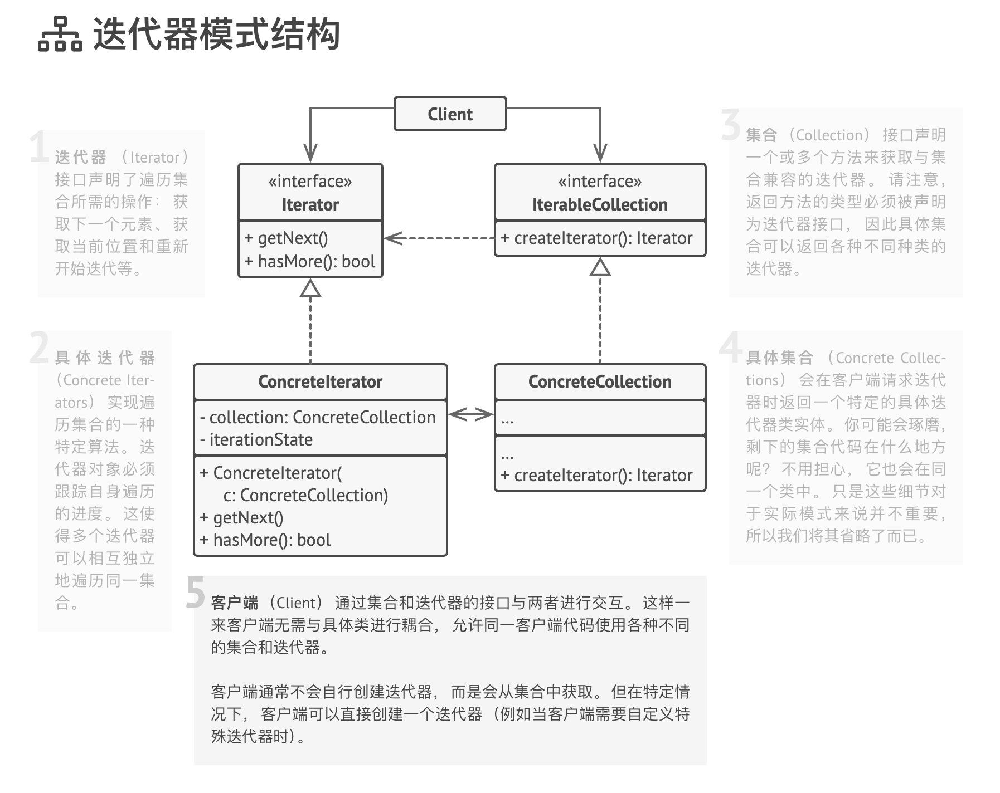
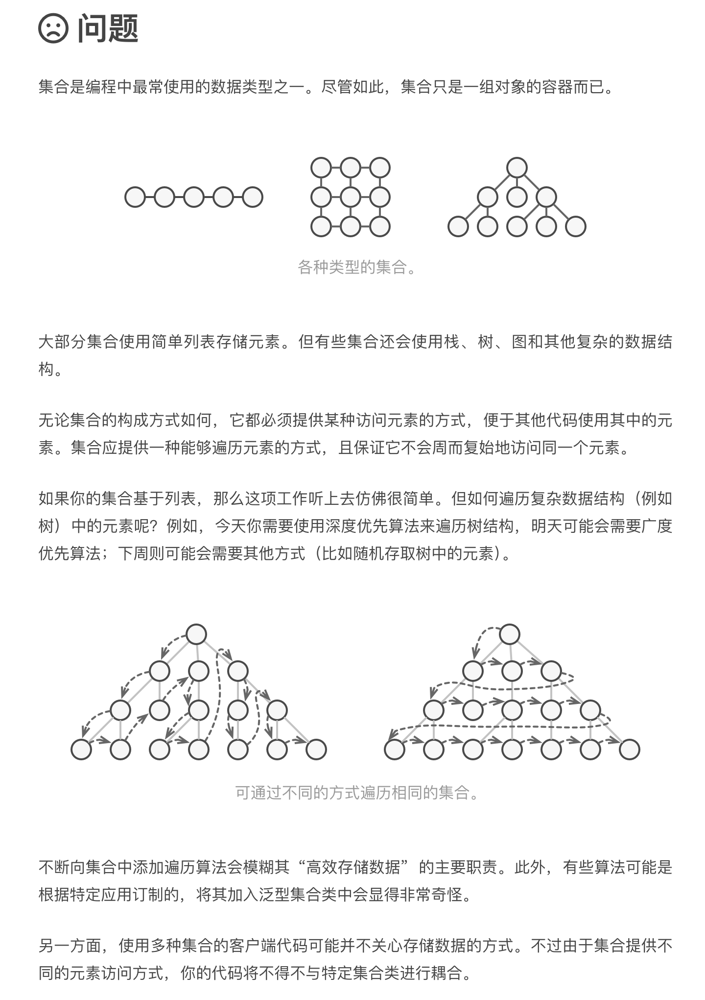

# 迭代器模式

iterator

迭代器是一种行为设计模式， 让你能在不暴露复杂数据结构内部细节的情况下遍历其中所有的元素。

在迭代器的帮助下， 客户端可以用一个迭代器接口以相似的方式遍历不同集合中的元素。

使用示例： 该模式在 TypeScript 代码中很常见。 许多框架和程序库都使用它来提供遍历其集合的标准方式。

识别方法： 迭代器可以通过导航方法 （例如 next 和 pre­vi­ous 等） 来轻松识别。 使用迭代器的客户端代码可能没有其所遍历的集合的直接访问权限。

## 模式结构

## 问题

